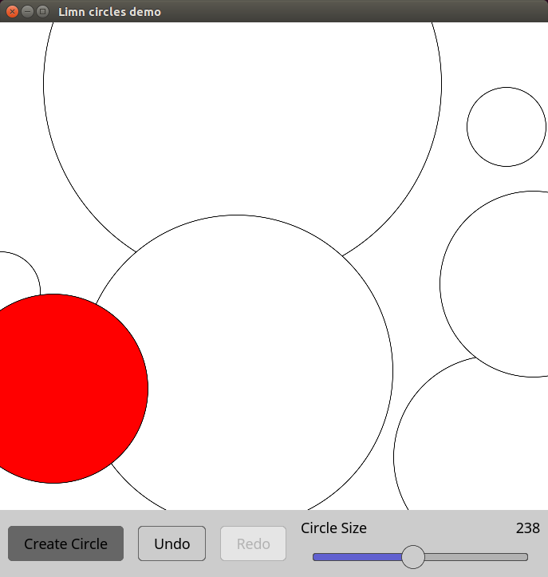

## Limn

[](https://travis-ci.org/christolliday/limn)
[](https://ci.appveyor.com/project/christolliday/limn/branch/master)

**WARNING: Has primarily been tested on X11, serious bugs exist and all APIs are likely to change.**

An early stage, experimental, cross platform GUI library written in Rust.

Limn uses [webrender](https://github.com/servo/webrender) for rendering, [cassowary](https://github.com/dylanede/cassowary-rs) for layout,
and [glutin](https://github.com/tomaka/glutin) for window handling.

## Motivation

To improve the state of GUI programming in Rust, by providing a relatively low level, high performance library for constructing GUIs,
with a focus on composability, extensibility and minimal boilerplate.

Limn aims to have a relatively small, easy to learn core API for defining components, and a set of bundled components built with that API,
that can easily be replaced or customized by the end user.

Eventually it could provide the foundation for high level DSLs or language bindings.

Limn also aims to fill some gaps in the Rust GUI ecosystem by providing functionality as separate crates when possible, so that they
can (eventually) be useful to other GUI libraries, frameworks or applications, with or without limn.
Currently these include `limn-layout` and `limn-text-layout`.

## Screenshots



### Running examples under NixOS

winit needs X11 libraries at runtime. To get them on NixOS, you can create a `default.nix` file with the following content:

```
with import <nixpkgs> {}; {
  cargoEnv = stdenv.mkDerivation {
    name = "limn";
    shellHook = with xorg; ''
      export LD_LIBRARY_PATH=/run/opengl-driver/lib/:${lib.makeLibraryPath (with xorg; [libX11 libXcursor libXxf86vm libXi libXrandr xinput zlib])}
    '';
  };
}
```

then, running example should work as

```
$ nix-shell --run bash
$ cargo run --release --example crud
```

## License

Licensed under either of

 * Apache License, Version 2.0, ([LICENSE-APACHE](LICENSE-APACHE) or http://www.apache.org/licenses/LICENSE-2.0)
 * MIT license ([LICENSE-MIT](LICENSE-MIT) or http://opensource.org/licenses/MIT)

at your option.

### Contribution

Unless you explicitly state otherwise, any contribution intentionally submitted
for inclusion in the work by you, as defined in the Apache-2.0 license, shall be dual licensed as above, without any
additional terms or conditions.
